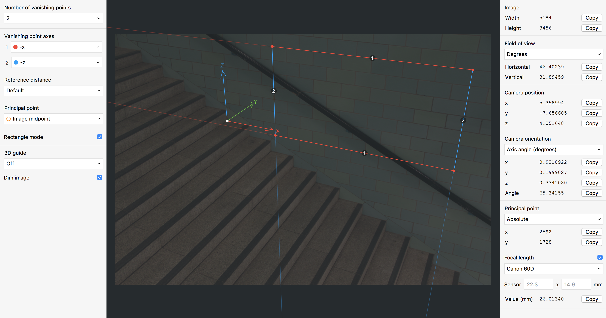
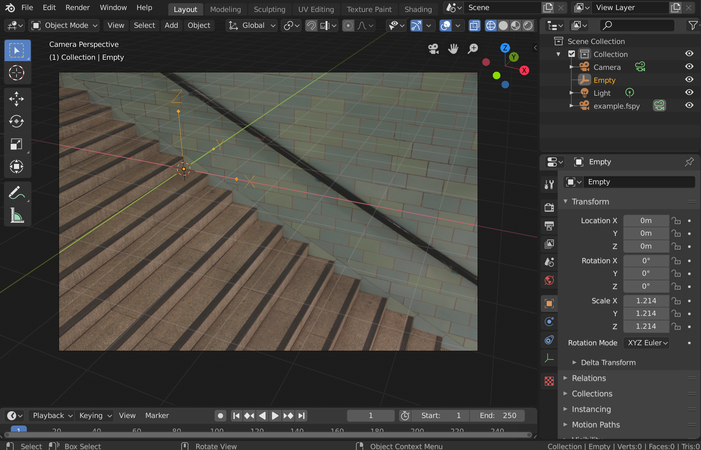

# What is this?

This is the official [fSpy](https://fspy.io) import add-on for [Blender](https://blender.org). The two images below show an fSpy project (top) and a matching Blender camera created by the add-on (bottom).

# Getting started

## 1. Downloading the latest version

[Download the latest version](https://github.com/stuffmatic/fSpy-Blender/releases). Make sure you download the file called `fSpy-Blender-x.y.z.zip`.

### ⚠️ __Important note for mac users__ ⚠️

Safari seems to unzip downloaded zip archives automatically by default. Since the add-on must be installed as a zip file, you have to do one of the following

* Disable the auto-unzip behaviour and download the add-on again
* Manually re-archive the automatically unzipped folder and point Blender to this file when installing

## 2. Installing the add-on

Open the preferences window by selecting Preferences from the Edit menu

Select the _Add-ons_ tab and press the _Install_ button

Select the downloaded zip-file and press _Install Add-on from file_

Locate the add-on in the list and enable it by pressing the checkbox.

## 3. Using the add-on

Once the add-on is installed and activated, fSpy project files can be imported by selecting _fSpy_ from the _Import_ menu.

The importer creates a camera with the same name as the project file.

### Import settings

__Update existing import (if any)__ - If checked, any previously created camera with a name matching the project filename will be updated. If unchecked, a new camera will be created on each import. 

__Import background image__ - If checked, the image from the fSpy project file will be used as the background image for the Blender camera.
