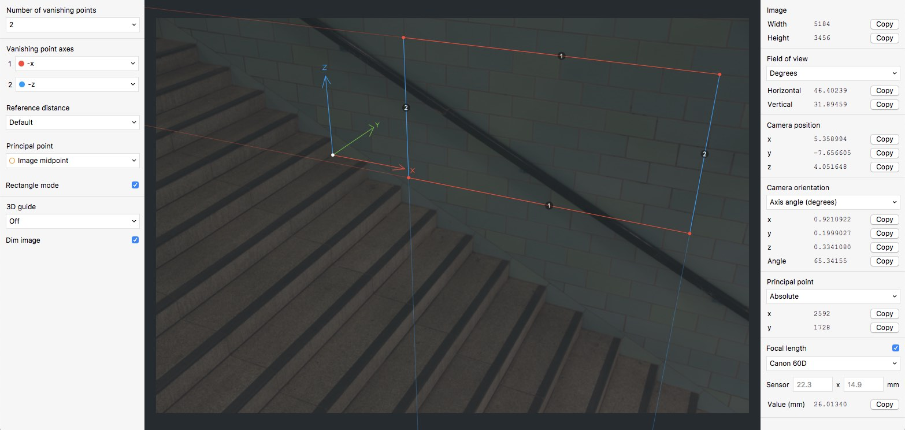
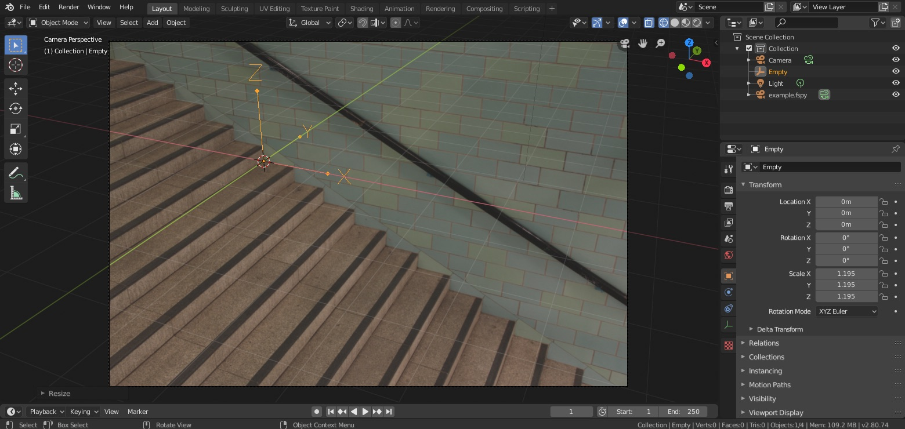
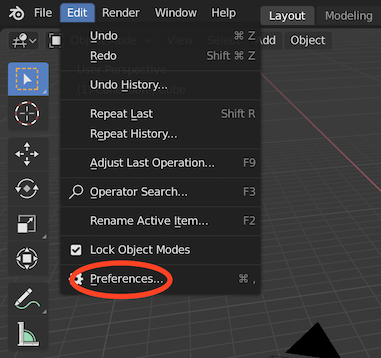
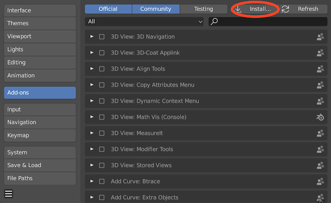
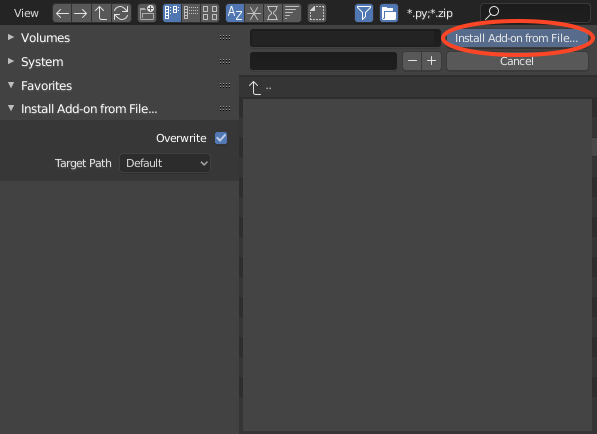
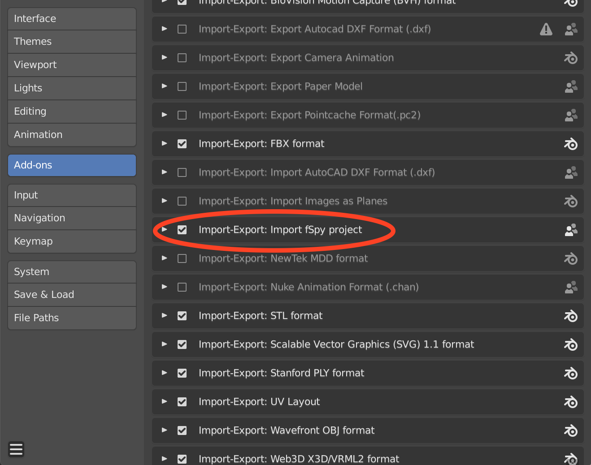
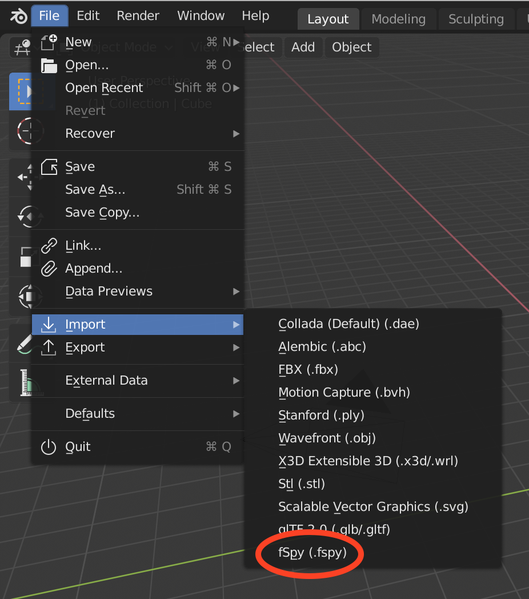
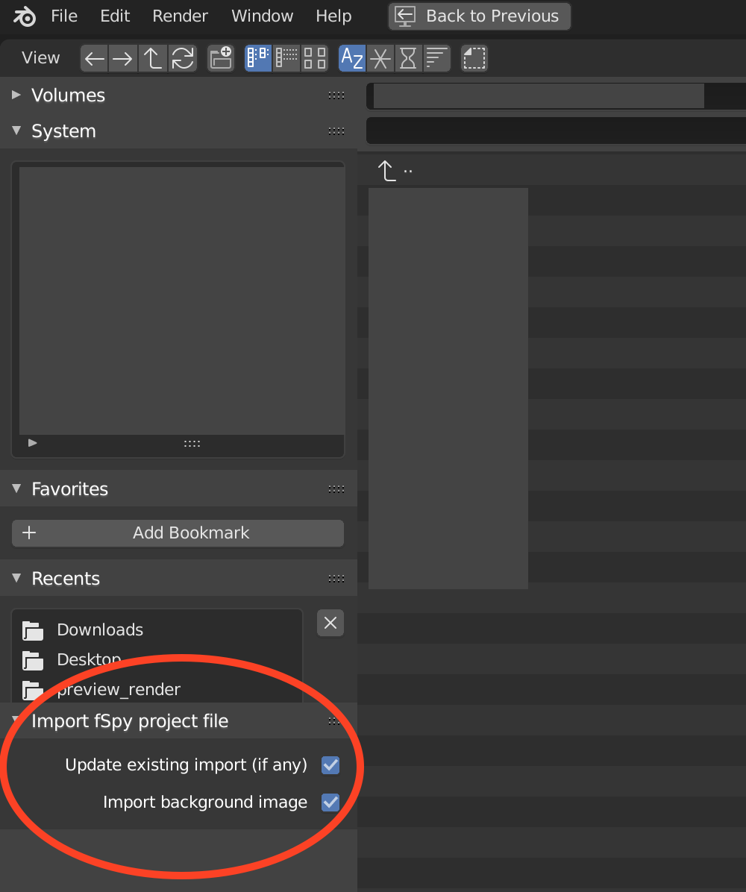

# What is this?

This is the official [fSpy](https://fspy.io) importer add-on for [Blender](https://blender.org). The two images below show an fSpy project (top) and a matching Blender camera created by the importer (bottom).

# Getting started

## 1. Download the add-on

[Download the latest version](https://github.com/stuffmatic/fSpy-Blender/releases/latest) (make sure you download the file called `fSpy-Blender-x.y.z.zip`).

### ⚠️ __Important note for mac users__ ⚠️

If you're using Safari, make sure you __download the add-on by right clicking and choosing "Download Linked File"__. This prevents the downloaded file from getting unzipped automatically.

## 2. Install the add-on

Open the preferences window by selecting Preferences from the Edit menu

Select the _Add-ons_ tab and press the _Install_ button

Select the downloaded zip-file and press _Install Add-on from file_

Locate the fSpy importer in the add-on list and enable it by pressing the checkbox.

## 3. Import an fSpy project file

Once the add-on is installed and activated, fSpy project files can be imported by selecting _fSpy_ from the _Import_ menu. This will create a camera with the same name as the imported project file.

### Import settings

At the bottom left in the importer's file browser, there is a panel with import settings.

__Update existing import (if any)__ - If checked, any previously created camera with a name matching the project filename will be updated. If unchecked, a new camera will be created on each import. 

__Import background image__ - If checked, the image from the fSpy project file will be used as the background image for the Blender camera.

# Support for Blender versions older than 2.80

Starting with version 1.0.3, the addon is only compatible with Blender 2.80 and up. If you are using an older Blender version, please [download version 1.0.2](https://github.com/stuffmatic/fSpy-Blender/releases/tag/v1.0.2) of the add-on.
